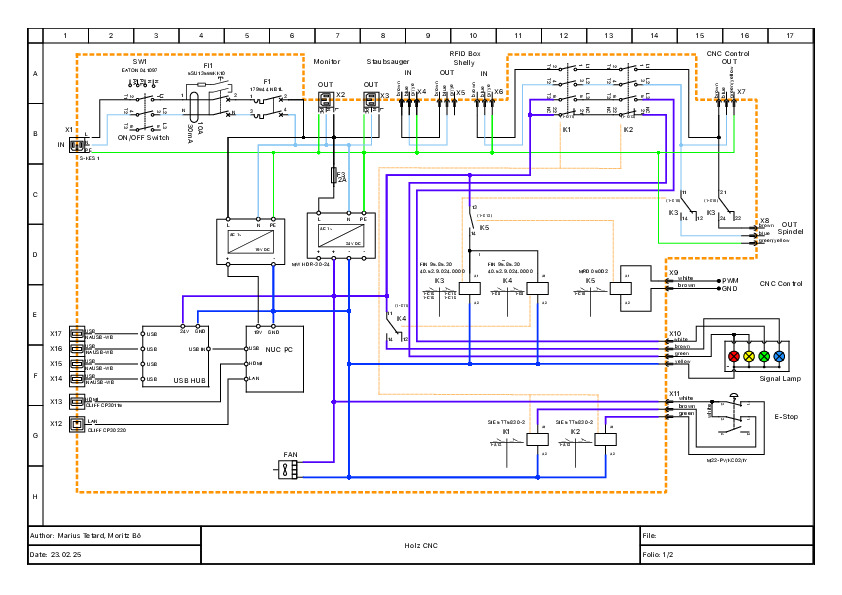

# Holz-CNC Elektronik

Dieses Repository dient der Dokumentation des Aufbaus unserer Holz-CNC, einschließlich der Elektronik.

Unter "Rechnungen" befinden sich die Rechnungen mit allen bestellten Teilen.

Unter "HW" sind der Schaltplan und die 3D-Druckteile zu finden. Dieser wurde mit [QElectroTech](https://qelectrotech.org/) erstellt.

[Original CNC + Controller](https://makerstore.krilano.com/product/full-parts-bundle-to-build-an-x-carve-style-cnc/)

Main Idea
========= 

Fragen ?
========

Bei Fragen wendet euch bitte an das Holz-CNC-Team oder die Maintainer dieses Repos.

